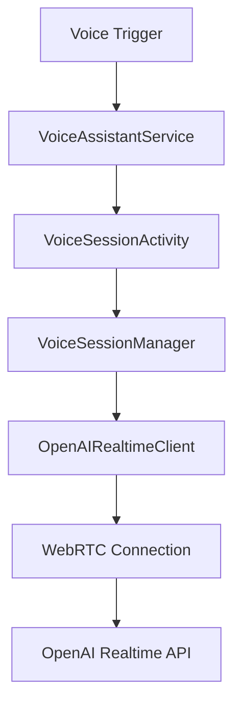

# Simon Mobile 🎙️

[](LICENSE)
[](https://android-arsenal.com/api?level=31)
[](https://kotlinlang.org)

## 🌟 Overview

Simon Mobile is an Android voice assistant that uses OpenAI's Realtime API for natural, human-like speech conversations. It functions as a system-level digital assistant that can replace Google Assistant on Android devices, providing a more conversational and context-aware AI experience.


## ✨ Features

- 🎯 **System Integration** - Works as your device's default assistant
- 🗣️ **Natural Conversations** - Powered by OpenAI's Realtime API for fluid, speech-to-speech interactions
- 🎨 **Minimal UI** - Clean, distraction-free interface with visual feedback
- 🔊 **WebRTC Audio** - High-quality, low-latency audio streaming
- 🔒 **Privacy First** - Your API key, your control - no intermediary servers
- ⚡ **Fast Response** - Direct WebRTC connection for minimal latency
- 🎭 **Customizable Personality** - Configure the assistant's behavior and responses

## 📋 Requirements

- Android 12+ (API level 31)
- OpenAI API key with Realtime API access
- Active internet connection

## 🚀 Getting Started

### Prerequisites

1. **OpenAI API Key**
   - Sign up at [OpenAI Platform](https://platform.openai.com)
   - Generate an API key with Realtime API access
   - Keep your key secure - you'll need it for setup

2. **Development Environment**
   - Android Studio Hedgehog (2023.1.1) or newer
   - JDK 21
   - Android SDK with API level 36 (Android 15)

### Installation

1. **Clone the repository**
   ```bash
   git clone https://github.com/yourusername/simon-mobile.git
   cd simon-mobile
   ```

2. **Configure your API key**
   ```bash
   cp config.properties.example config.properties
   ```
   Edit `config.properties` and add your OpenAI API key:
   ```properties
   openai.api.key=your_api_key_here
   ```

3. **Build and install**
   ```bash
   ./gradlew installDebug
   ```
   Or open the project in Android Studio and run it directly.

4. **Set as default assistant**
   - Go to **Settings** → **Apps** → **Default apps** → **Digital assistant app**
   - Select **Simon** from the list

   Or via ADB:
   ```bash
   adb shell settings put secure assistant "com.simon.app/.VoiceAssistantService"
   ```

## 🏗️ Architecture

Simon Mobile follows modern Android development best practices:



### Key Components

- **VoiceAssistantService** - System-level service that handles assistant triggers
- **VoiceSessionActivity** - Manages the UI and user interaction
- **VoiceSessionManager** - Coordinates the voice session lifecycle
- **OpenAIRealtimeClient** - Handles WebRTC connection and OpenAI API communication

For detailed architecture documentation, see [Architecture Guide](docs/ARCHITECTURE.md).

## 📱 Usage

Once configured as your default assistant:

1. **Activate Simon**:
   - Long press the power button (on supported devices)
   - Say "Hey Google" (if configured)
   - Use your device's assistant gesture

2. **Start talking** - Simon will listen and respond naturally

3. **End session** - Tap the screen or say "goodbye"

## 🛠️ Development

### Project Structure

```
simon-mobile/
├── app/
│   ├── src/main/java/com/simon/app/
│   │   ├── config/        # Configuration management
│   │   ├── framework/     # Android framework integrations
│   │   ├── ui/           # User interface components
│   │   ├── voice/        # Voice interaction logic
│   │   └── webrtc/       # WebRTC implementation
│   └── src/test/         # Unit tests
├── docs/                 # Documentation
└── gradle/              # Build configuration
```

### Building

```bash
# Debug build
./gradlew assembleDebug

# Release build (requires signing key)
./gradlew assembleRelease

# Run tests
./gradlew test

# Run with coverage
./gradlew jacocoTestReport
```

### Testing

The project uses:
- **JUnit 4** for unit testing
- **Mockito** for mocking
- **Robolectric** for Android framework testing

**Note**: Tests involving WebRTC components may skip due to native library requirements in the test environment.

## 📚 Documentation

- [Architecture Overview](docs/ARCHITECTURE.md)
- [Development Guide](docs/DEVELOPMENT.md)
- [API Documentation](docs/API.md)
- [WebRTC Integration](docs/webrtc_flow.md)

## 📄 License

This project is licensed under the Apache License 2.0 - see the [LICENSE](LICENSE) file for details.

```
Copyright 2025 [Your Name]

Licensed under the Apache License, Version 2.0 (the "License");
you may not use this file except in compliance with the License.
You may obtain a copy of the License at

    http://www.apache.org/licenses/LICENSE-2.0

Unless required by applicable law or agreed to in writing, software
distributed under the License is distributed on an "AS IS" BASIS,
WITHOUT WARRANTIES OR CONDITIONS OF ANY KIND, either express or implied.
See the License for the specific language governing permissions and
limitations under the License.
```